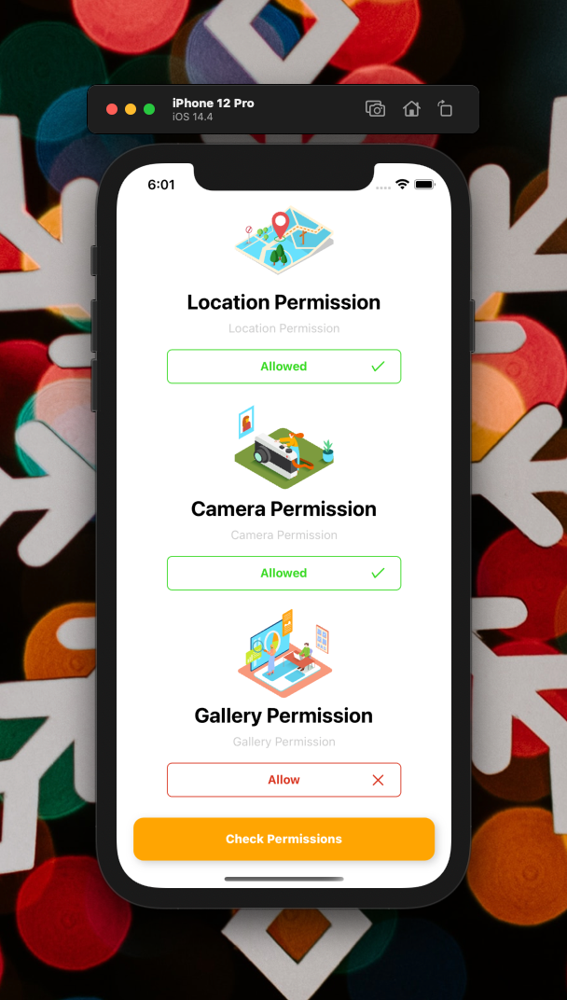

[](https://github.com/WrathChaos/react-native-permission-service)

[](https://github.com/WrathChaos/react-native-permission-service)

[](https://www.npmjs.com/package/react-native-permission-service)
[](https://www.npmjs.com/package/react-native-permission-service)

[](https://opensource.org/licenses/MIT)
[](https://github.com/prettier/prettier)

<p align="center">
  
  
</p>

# Installation

Add the dependency:

```bash
npm i react-native-permission-service
```

## Peer Dependencies

<h5><i>IMPORTANT! You need install them</i></h5>

```js
"react-native-permissions": ">= 2.2.0"
```

# Usage

## Import

```jsx
import {
  hasAllPermissionsFunc,
  requestCameraPermission,
  requestLocationPermission,
  requestPhotoLibraryPermission,
} from "react-native-permission-service";
```

## Location Permission Usage

```jsx
requestLocationPermission().then((result: string) => {
  if (result === RESULTS.GRANTED) this.setState({ isLocPermGranted: true });
});
```

## Camera Permission Usage

```jsx
requestCameraPermission().then((result: string) => {
  if (result === RESULTS.GRANTED) this.setState({ isCameraPermGranted: true });
});
```

## Gallery Permission Usage

```jsx
requestPhotoLibraryPermission().then((result: string) => {
  if (result === RESULTS.GRANTED)
    this.setState({ isPhotoLibraryPermGranted: true });
});
```

## Has All Permission Usage

```jsx
checkPermissions = () => {
  const {
    isLocPermGranted,
    isCameraPermGranted,
    isPhotoLibraryPermGranted,
  } = this.state;
  hasAllPermissionsFunc().then((res: any) => {
    res.map((item: any) => {
      switch (item.type) {
        case "location":
          this.setState({ isLocPermGranted: item.permission });
          break;
        case "camera":
          this.setState({ isCameraPermGranted: item.permission });
          break;
        case "photoLibrary":
          this.setState({ isPhotoLibraryPermGranted: item.permission });
          break;
      }
    });
    if (isLocPermGranted && isCameraPermGranted && isPhotoLibraryPermGranted) {
      // Navigation should be here
      alert("All Permissions are GRANTED!");
    }
  });
};
```

## Example Project 😍

You can checkout the example project 🥰

Simply run

- `npm i`
- `npx pod-install`// if you run it on iOS
- `react-native run-ios/android`

should work of the example project.

## Future Plans

- [x] ~~LICENSE~~
- [ ] Write an article about the lib on Medium

### iOS Future Plans

- [ ] App Tracking Transparency Permission Handling
- [ ] Bluetooth Peripheral Permission Handling
- [ ] Calendars Permission Handling
- [ ] Contacts Permission Handling
- [ ] FaceID Permission Handling
- [ ] Microphone Permission Handling
- [ ] Photo Library Add Only Permission Handling
- [ ] Reminders Permission Handling
- [ ] Siri Permission Handling
- [ ] Speech Recognition Permission Handling
- [ ] Store kit Permission Handling

### Android Future Plans

- [] Accept Handover Permission Handling
- [] Access Background Location Permission Handling
- [] Activity Recognition Permission Handling
- [] Add Voicemail Permission Handling
- [] Answer Phone Calls Permission Handling
- [] Body Sensors Permission Handling
- [] Call Phone Permission Handling
- [] Get Accounts Permission Handling
- [] Process Outgoing Calls Permission Handling
- [] Read Calendar Permission Handling
- [] Read Call Log Permission Handling
- [] Read Contacts Permission Handling
- [] Read External Storage Permission Handling
- [] Read Phone Numbers Permission Handling
- [] Read Phone State Permission Handling
- [] Read SMS Permission Handling
- [] Receive MMS Permission Handling
- [] Receive SMS Permission Handling
- [] Receive Wap Push Permission Handling
- [] Record Audio Permission Handling
- [] Send SMS Permission Handling
- [] Use Sip Permission Handling
- [] Write Calendar Permission Handling
- [] Write Call Log Permission Handling
- [] Write Contacts Permission Handling
- [] Write External Storage Permission Handling

# Change Log

Change log will be here !

## Author

FreakyCoder, kurayogun@gmail.com

## License

React Native Permission Service is available under the MIT license. See the LICENSE file for more info.
